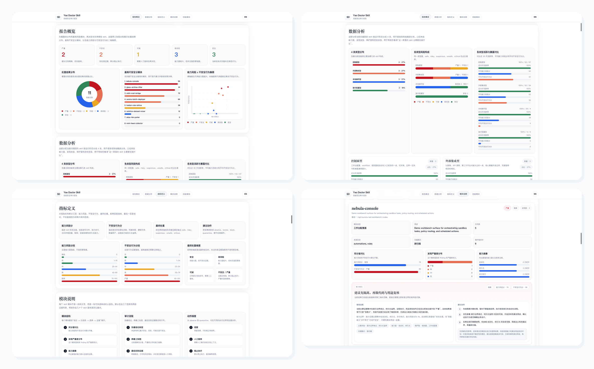

# Yao Doctor Skill

`yao-doctor-skill` is a security-first audit skill for local skill libraries and AI workbench surfaces.

[中文说明](docs/中文说明.md)

It scans skill packages and supported workbench configuration targets, separates `capability risk` from `unsafe behavior`, and renders a bilingual HTML audit report with:

- global overview
- type-based data analysis
- per-module audit opinion cards
- concrete evidence trails with paths, lines, evidence kind, and confidence

## Public Example Report

This repository does not publish real local scan outputs. Instead it includes a fully fictional example report for UI and documentation purposes.

- Example HTML report: `docs/example-report/report.html`
- Example JSON payload: `docs/example-report/report.json`
- Example Markdown summary: `docs/example-report/report.md`



## What It Audits

- local skill packages discovered by `SKILL.md`
- supported Codex and Claude workbench surfaces
- project-level agent surfaces such as `AGENTS.md`, `CLAUDE.md`, and selected `.claude/.codex` files

## Core Output

The main runner writes:

- `report.json`
- `report.md`
- `report.html`

It also updates stable local entry points:

- `_yao_doctor_skill_reports/full-library-latest/report.html`
- `_yao_doctor_skill_reports/changed-only-latest/report.html`

Generated reports and caches are intentionally gitignored in this repository.

## Quick Start

```bash
cd yao-doctor-skill
python3 scripts/run_yao_doctor_skill.py --full-scan
```

Validate the current report UI contract:

```bash
python3 scripts/validate_report_ui_contract.py _yao_doctor_skill_reports/full-library-latest/report.html
```

## Key Files

- `SKILL.md`
- `references/security-principles.md`
- `references/detection-taxonomy.md`
- `references/report-blueprint.md`
- `references/report-ui-contract.md`
- `scripts/scan_security_skills.py`
- `scripts/render_security_report.py`
- `scripts/run_yao_doctor_skill.py`

## Notes

- This repository separates broad permissions from confirmed unsafe behavior.
- The current report UI is treated as a fixed contract and should not drift silently.
- “Usage frequency” in the report is currently an activity proxy based on recency, not true invocation telemetry.
